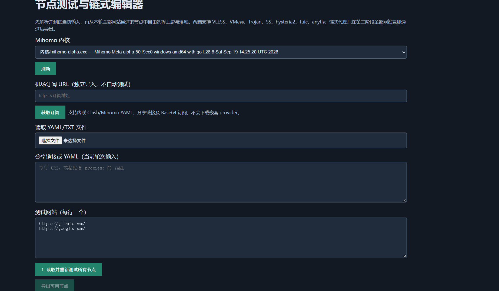
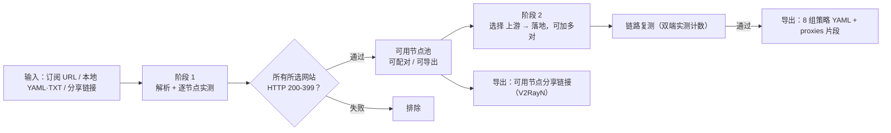

<div align="center">

# Mihomo 链式编辑器

**Windows x64 便携本地面板：把机场订阅/分享链接变成「实测通过」的链式跳板配置**

[](LICENSE)
[](#环境要求)
[](https://github.com/RNGCHEER/mihomo-chain-panel/releases)
[](#快速开始)
[](#环境要求)

双击 `启动面板.cmd` → 浏览器打开 <http://127.0.0.1:39242/>

站内自带 Node、Python、curl 与 Mihomo 内核，**不装环境、不改注册表、不写系统目录**。

</div>

---

> **一句话**：先让每个节点在你指定的网站上真跑一遍，再让通过的双端做二次实测的链式跳板，最后导出经 `mihomo -t` 校验的八组策略 YAML。所有「通过」都有实测计数支撑，不是配置看起来对。

<!-- 想换截图：覆盖 docs/screenshot.png（推荐 1280–1600px 宽，深色主题）即可，无需改 README
-->
<p align="center">
  
  <br>
  <sub>面板界面（空状态）：选内核 → 填输入与测试网站 → 阶段一点测，阶段二配对与导出</sub>
</p>

## 为什么用它

- **只信实测**：节点和链路都走独立本地 HTTP listener 真实出网，跟随重定向，要求无传输错误且**所有**所选网站最终状态码落在 200–399；403 一律不通过。
- **零安装**：运行时全部随包，双击即用；重复双击复用已有服务，不会起两份。
- **可审计**：内置 `verify_v2.cjs` 验收脚本，本地 SOCKS 双跳夹具逐项断言（见[验收与限制](#验收与限制)）。
- **不留凭据**：任务数据已明确排除在发布包外；导出前用所选内核做 `-t` 校验。
- **不碰废弃写法**：只使用 `dialer-proxy` 链式代理，不使用已废弃的 `relay` 策略组。

## 目录

[快速开始](#快速开始) · [两阶段工作流](#两阶段工作流) · [判定标准](#判定标准) · [输出策略组](#输出策略组) · [支持的协议](#支持的协议) · [导出与产物](#导出与产物) · [验收与限制](#验收与限制) · [常见问题](#常见问题) · [目录结构](#目录结构) · [许可](#许可)

## 快速开始

1. 下载 [Releases](https://github.com/RNGCHEER/mihomo-chain-panel/releases) 里的 ZIP，解压到任意目录（普通用户即可，不需要管理员权限）。
2. 双击 `启动面板.cmd`：启动器探测端口 → 后台拉起本地服务 → 自动打开浏览器。
3. 浏览器访问 <http://127.0.0.1:39242/>。**关闭浏览器不会停止服务**，重复双击 = 复用现有服务。

> 源码方式运行：仓库不含 `runtime/`、`内核/`、`数据/`（已在 `.gitignore` 排除），需自行准备运行时后再启动，或直接用 Releases 包。

### 环境要求

| 项目 | 要求 |
|---|---|
| 系统 | Windows x64 |
| 权限 | 普通用户即可（服务仅监听 `127.0.0.1`） |
| 依赖 | 无（Node 24 / Python 3.12 / curl 8.21 / Mihomo 1.19.31 随包） |
| 端口 | 面板固定 `127.0.0.1:39242`；测试端口 `18100` 起、`18350` 起、`19096`、`19097` 需空闲 |
| 上限 | 单轮最多 300 节点、300 配对；测试网站最多 20 个（超出部分自动截断） |

## 两阶段工作流



**阶段 1 — 解析并实测节点**

1. 选择 Mihomo 内核（自动列出并标注版本，不可用的内核置灰）。
2. 输入节点：机场订阅 URL 独立导入（**不自动测试**）／本地 `.yaml` `.yml` `.txt` 文件／直接粘贴 YAML 或每行一条分享链接。
3. 填写测试网站（每行一个，默认 `github.com`、`google.com`；输入值会覆盖默认）。
4. 点击 **`1. 读取并重新测试所有节点`**。

节点列表显示每个网站的延迟（ms）与出口 IP：全部通过 = 绿色 ✅，任一失败 = 红色 ❌。

**阶段 2 — 配对、复测、导出**

1. 只能从本轮**全部网站通过**的节点中选择上游与落地，添加任意明确配对（可多对）。
2. 点击 **`2. 测试链路并导出`**。只有实际复测通过的链路才会进入链式跳板组。
3. 也可以**不加任何配对直接导出**，得到不含链路的八组配置。

> ⚠️ 修改输入、测试网站或内核后，本轮结果立即失效，**必须重新测试**；服务重启后同样必须重测。

## 判定标准

| 环节 | 通过条件 | 不通过 |
|---|---|---|
| 单节点 | 所有所选网站：无传输错误且最终状态码 **200–399** | 超时、连接错误、4xx/5xx（**403 不通过**） |
| 链路（上游→落地） | 双端实际经过 + 所有所选网站同样满足 200–399 | 任一网站失败即整条链路排除 |
| 配置导出 | 用所选内核执行 `mihomo -t` 校验通过 | `-t` 失败则不产出最终 YAML |

实现细节：每个节点、每条链路使用**独立 HTTP listener**；测试时跟随重定向，但最终状态码必须达标。

## 输出策略组

固定输出八组，空组自动使用 `REJECT`：

| 组名 | 成员 |
|---|---|
| 手动选择 | 全部可用节点 |
| 自动选择 | 全部可用节点 |
| ai 自动选择 | 全部可用节点 |
| ai 服务 | 仅 `DIRECT` / 手动选择 / ai 自动选择 |
| 国内网络 | 仅 `DIRECT` |
| 非中国 | 仅 手动选择 / ai 自动选择 / 自动选择 |
| 漏网之鱼 | 仅 手动选择 / ai 自动选择 / 自动选择 |
| 链式跳板 | 仅**实际复测通过**的链路 |

> 面板只请求你选择的测试网站，**不额外访问出口地理服务**，因此 AI 候选组保持 `REJECT`——本工具不声称出口稳定，也不声称能解锁 AI 服务。

## 支持的协议

上下游两端均支持，用于链式代理：

| 协议 | 克隆方式 |
|---|---|
| VLESS / VMess / Trojan | 整体克隆落地节点，仅改 `name` 并设置 `dialer-proxy` 指向上游 |
| Shadowsocks (SS) | 同上 |
| hysteria2 | 同上 |
| tuic | 同上 |
| anytls | 同上 |

**TLS、Reality、认证与传输字段一律不改动。** 会主动拒绝的输入：重复名称、自连（上游 = 落地）、重复配对、输入中已存在 `dialer-proxy` 的歧义链。

分享链接转换：**保留有效节点、重复项合并**，不支持项逐条跳过并显示**已脱敏**行号与原因；只有零有效节点时才拒绝整批。

## 导出与产物

| 产物 | 位置 | 说明 |
|---|---|---|
| 完整配置 | 项目根目录 `<名称>.yaml` | 八组策略 + 规则，导出前经 `mihomo -t` 校验 |
| proxies 片段 | 项目根目录 `<名称>.proxies.yaml` | 仅 `proxies:`，可粘贴进其他 Clash/Mihomo 客户端 |
| 可用节点链接 | 面板「导出可用节点」 | 本轮通过测试的节点转成 V2RayN 分享链接 |
| 任务数据 | `任务/<uuid>/` | 输入、节点、配对、`报告.json` 等 |

同名文件已存在时自动追加时间戳，不会覆盖。

> 🔒 **`任务/` 目录可能包含订阅地址与节点凭据，切勿提交或公开发布。** 发布 ZIP 已排除任何 YAML、任务数据与测试日志。取消生成时只留下任务内部的测试配置与报告，不会产出根目录最终 YAML。

## 验收与限制

先启动面板，再运行验收脚本：

```bat
runtime\node\node.exe 脚本\verify_v2.cjs
```

脚本会在项目根目录生成 `VERIFICATION.json`（本地证据，默认不纳入版本库），当前逐项断言：

- 通过两个本地 SOCKS 端点完成真实的节点矩阵测试
- 双跳实际经过计数（真实两段转发）
- 两个测试网站参与校验
- **第二个网站返回 403 时排除该链路**
- 八组组名与成员关系精确匹配
- 根目录 YAML 输出前执行 Mihomo `-t`
- `generate=false` 时确实不产出最终 YAML
- 自连 / 重复 / 已存在 dialer 的输入被拒绝
- 七类协议克隆后字段保留

**它明确是本地 SOCKS 双跳夹具，不是真实远程节点测试。** 已知限制：

- 七类协议的**远端互通、UDP/QUIC 与 Reality 组合不保证通用**，必须以当前内核对你实际配对的测试为准；字段保留测试 ≠ 已验证七类远端服务器可用。
- 浏览器自动化在本轮验收中未覆盖（超时）；已验收：本地 API、真实内核、本地双跳、便携启动。
- 未实现：自动地理识别、订阅 `provider` 下载、三级及以上多级链导入。

## 常见问题

| 现象 | 原因 / 处理 |
|---|---|
| 提示「端口 39242 已被其他服务占用」 | 有别的程序占用该端口；关闭占用方后重试 |
| 提示后端启动失败 | 查看项目根目录 `启动日志.txt` |
| 后端已启动但页面空白 | 用 <http://127.0.0.1:39242/> 打开（服务只监听本机） |
| 链路一直不通过 | 该配对实测未达标（例如第二大测试站返回 403），换配对重测 |
| 改了输入但结果还是旧的 | 结果随输入/网站/内核变化立即失效，需重新执行阶段 1 |
| 服务重启后 | 必须重新测试，任务状态不跨进程恢复 |

## 目录结构

```
mihomo-chain-panel/
├─ 启动面板.cmd          # 双击入口：探测端口 → 拉起后端 → 打开浏览器
├─ launch.cjs            # 便携启动器（端口检测 / 后台服务 / 复用）
├─ panel.html            # 面板界面
├─ panel.js              # 前端逻辑与分享链接导出
├─ 脚本/
│  ├─ server_v2.js       # 本地 HTTP 服务与任务编排（127.0.0.1:39242）
│  ├─ sub2mihomo.py      # 订阅 / 分享链接 → Mihomo 节点
│  ├─ cores.js           # 内核发现与版本探测
│  ├─ chain_model.js     # 链式节点克隆与校验规则
│  ├─ 21_matrix.js       # 节点矩阵实测
│  ├─ chain_matrix.js    # 链路复测
│  ├─ build_groups.js    # 八组策略构建
│  └─ verify_v2.cjs      # 本地验收脚本（SOCKS 双跳夹具）
├─ runtime/              # 随包 Node / Python / curl（发布包内，仓库已忽略）
├─ 内核/                 # Mihomo 内核（发布包内，仓库已忽略）
├─ 数据/                 # country.mmdb / geoip.metadb
├─ 任务/                 # 任务数据（含凭据，禁止发布）
├─ docs/screenshot.png   # README 用的面板截图
└─ 本地运行说明.txt
```

## 许可

本项目代码以 [MIT License](LICENSE) 发布，版权归 RNGCHEER。

随包分发的第三方组件（Node.js、CPython、curl、Mihomo 内核、GeoLite2 数据、npm `yaml` 等）**保留各自原始许可**，详见 [THIRD-PARTY-NOTICES.md](THIRD-PARTY-NOTICES.md)；发布包内附 `RELEASE-WHITELIST.json` 说明白名单与排除项。

> 本项目不提供、不内置任何订阅地址或节点，仅提供本地测试与配置生成工具。请遵守你所在地区的法律法规与服务条款。

## 参考

- Mihomo `dialer-proxy` 官方说明：<https://wiki.metacubex.one/config/proxies/dialer-proxy/#relay-select>
- Mihomo 内核：<https://github.com/MetaCubeX/mihomo>
